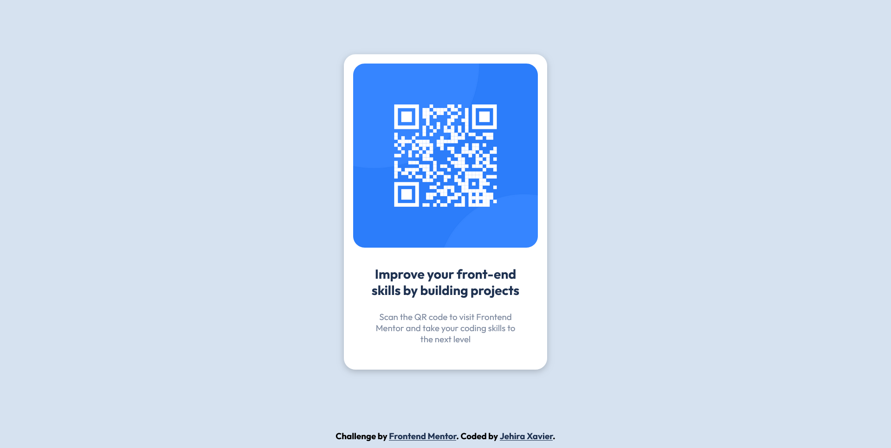

# Frontend Mentor - QR code component solution

This is a solution to the [QR code component challenge on Frontend Mentor](https://www.frontendmentor.io/challenges/qr-code-component-iux_sIO_H). Frontend Mentor challenges help you improve your coding skills by building realistic projects.

## Table of contents

- [Overview](#overview)
  - [Screenshot](#screenshot)
  - [Links](#links)
- [My process](#my-process)
  - [Built with](#built-with)
  - [What I learned](#what-i-learned)
  - [Continued development](#continued-development)
  - [Useful resources](#useful-resources)
- [Author](#author)

## Overview

### Screenshot



### Links

- Solution URL: [Github repo](https://github.com/JehiraXavier/qr-code-component)
- Live Site URL: [Github page](https://your-live-site-url.com)

## My process

### Built with

- Semantic HTML5 markup
- CSS custom properties
- Flexbox
- CSS Grid

### What I learned

I got much better understanding of flexbox and css layout.

```css
.wrapper {
  max-width: 350px;
  margin: auto;
  background-color: white;
  padding: 1rem;
  border-radius: 20px;
  box-shadow: 0 3px 10px rgb(0 0 0 / 0.2);
}
```

```css
main {
  height: 100vh;
  display: flex;
  text-align: center;
}
```

### Continued development

I would like to foucs css grid layout and flexbox further in the future.

### Useful resources

- [Centering a div](https://www.w3schools.com/howto/howto_css_center_website.asp) - This helped me how to center a div in the body of html.
- [Box shadow effect](https://css-tricks.com/almanac/properties/b/box-shadow/) - This site helped me further in box shadow effect

## Author

- Website - [Jehira Xavier](https://www.your-site.com)
- Frontend Mentor - [@JehiraXavier](https://www.frontendmentor.io/profile/JehiraXavier)
- Dribble - [@J_N_Xavier](https://dribbble.com/J_N_Xavier)
- Github - [@JehiraXavier](https://github.com/JehiraXavier)
